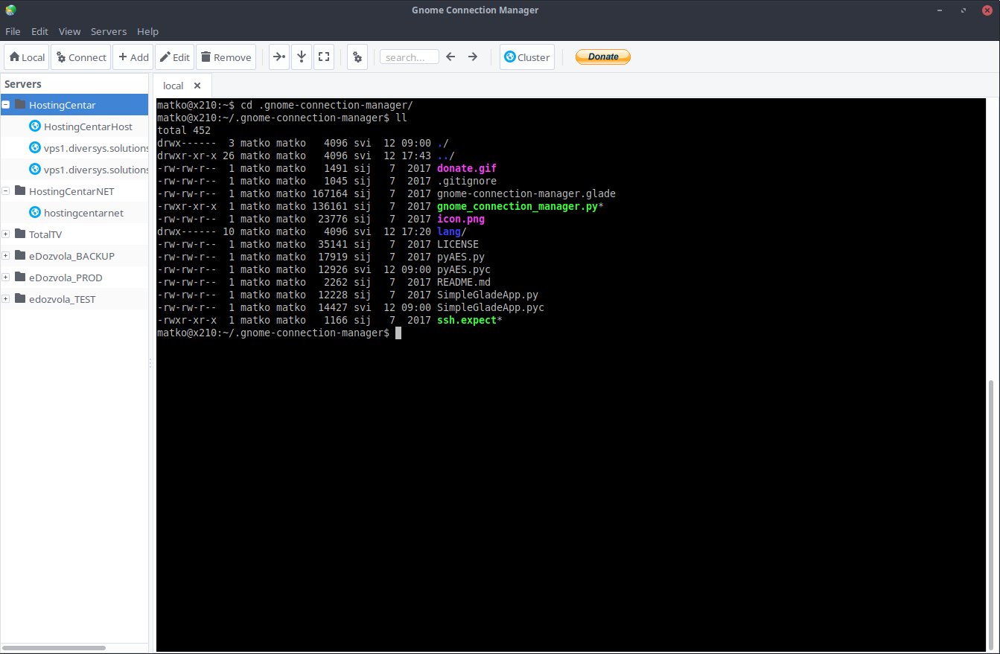

# gnome-connection-manager



Tabbed SSH connection manager for GTK+ environments.

- Gnome Connection Manager is licensed under the GNU General Public License version 3
- It's designed in Glade and written in python, so it just needs PyGTK to run in any linux environment
- Can store passwords for easy access to hosts
- Supports multiple ssh tunnels for each host
- Unlimited vertical/horizontal window splitting. You can have as many visible consoles as you want
- Drag&Drop tabs between consoles
- Connect to multiple hosts with just one click
- Grouping hosts
- Cluster mode. Work on several hosts at the same time
- Customizable shortcuts
- Send custom commands to hosts

## Dependencies
Make sure you have installed the following packages (Ubuntu):

- python-gtk2 (>= 2.22)
- expect
- python-vte
- libglade2-0
- python-glade2

On Ubuntu you can install them with the following one-liner:

```shell
sudo apt-get install python-gtk2 expect python-vte libglade2-0 python-glade2
```

## Installing
Once you have dependencies installed, it's as simple as placing gnome-connection-manager directory to a location of
your choice and typing in shell:

```shell
python gnome_connection_manager.py
```

The application will read your `LANG` environment variable and load appropriate translation file (if your language is 
supported), otherwise it will fallback to english.

If you want to start gnome-connection-manager with specific language start it with LANGUAGE parameter followed by language code, 
like so:

```shell
LANGUAGE=de_DE python gnome_connection_manager.py
```

If you want to run the application from menu/launcher you can create .desktop file in your 
/home/USERNAME/.local/share/applications directory. Assuming you placed gnome-connection-manager source in directory
/home/USERNAME/.gnome-connection-manager/ your .desktop file could look like this:

```text
[Desktop Entry]
Version=1.0
Encoding=UTF-8
Name=Gnome Connection Manager
Comment=A simple ssh connection manager for gnome
GenericName=Connection Manager
Exec=/home/USERNAME/.gnome-connection-manager/gnome_connection_manager.py
Terminal=false
Type=Application
Icon=/home/USERNAME/.gnome-connection-manager/icon.png
Categories=GTK;GNOME;Network;
```

Replace USERNAME in examples above with your username.

# Note about the author
The original author of GCM is Renzo Bertuzzi (kuthulu@gmail.com) and all credit goes to him. I really liked the 
application and decided to fix some bugs and add features that I need in everyday use. If you find my fork of GCM 
useful and would like to see some new features added don't hesitate to contact me at: matko.jun@gmail.com
